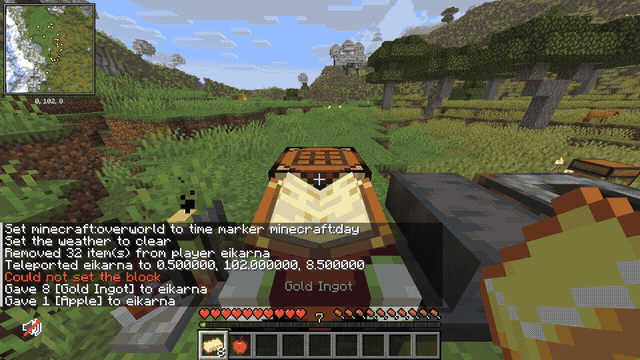
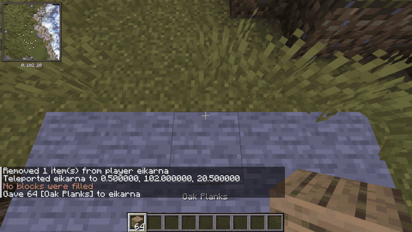
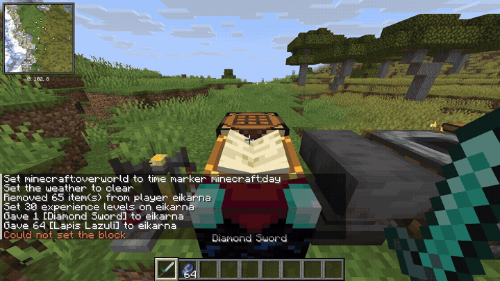
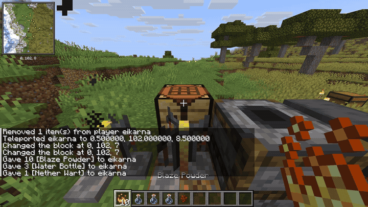
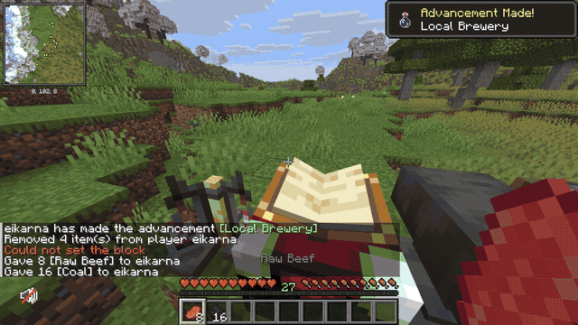
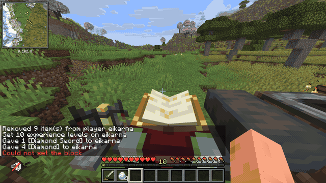
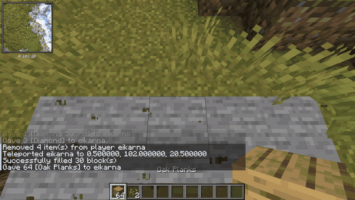

# ⚙️ Effector MCP (`effector-mcp`)

> **Robotic End-Effector & Physical Actuator Bridge for Minecraft.**  
> High-performance, standalone Model Context Protocol (MCP) server for Fabric 26.2. Enables autonomous AI coding agents, harnesses, and LLMs to interact with Minecraft through tick-synchronized physics, voxel reconnaissance, functional containers, and deep item serialization.


[](https://minecraft.net)
[](https://fabricmc.net)
[](https://modelcontextprotocol.io)
[](https://opensource.org/licenses/MIT)

---

## ⚡ Why Effector MCP?

Traditional Minecraft bot implementations rely on heavy external wrappers (like Baritone or Node.js Mineflayer) or brittle command-line scraping. **Effector MCP** is forged natively inside the Minecraft Java 26.2 client engine as an **End-Effector Actuator**:

* **🏎️ Zero-Latency 20 TPS Physics Sync (`execute_actions`):** Run multi-step macro sequences (sneaking, jumping, camera sweeps, backward bridging, weapon swapping) in exact lockstep with client physics ticks. No network jitter between consecutive sub-actions.
* **🧊 Voxel Chunk Reconnaissance (`scan_chunk`):** High-speed 3D voxel scanning with bounding-box volume optimization and custom regex/item filters. Perceive ores, structures, and containers with minimal token footprint.
* **🔨 Full Functional Workstations & Containers:** Seamless GUI control over **Enchanting Tables**, **Brewing Stands**, **Smokers & Furnaces**, **Anvils**, and **3x3 Crafting Tables**.
* **💎 Deep Item & Vitals Serialization:** Inspect exact durability (remaining & percentage), full enchantment lists with roman numeral levels, lore lines, custom names, and active potion effects (buffs/debuffs) with duration counters.
* **🤖 100% Harness Agnostic:** Works zero-shot with **Claude Code**, **Cursor IDE**, **Hermes Agent**, **DeepSeek**, **Pi Harness**, or any standard MCP client.

---

## 🎬 Proven Capabilities (Empirical Proof-of-Work)

Every capability below has been tested and verified live in Minecraft Java Edition 26.2:

### 1. 🍎 Procedural 3x3 Crafting Grid Assembly
The agent holds raw materials, procedurally distributes them across the 3x3 crafting matrix using simulated native right-clicks, places the core ingredient, and withdraws the crafted output:



### 2. 🌉 Autonomous Backward Sneak-Bridging
Executing complex macro movement: locking pitch to block edges, engaging sneak mode, moving backward across thin air, and consecutive block placement without falling off:



### 3. 🔮 Enchanting Table Automation
Inspecting the 3 available enchantment options, reading exact XP costs, clicking the chosen tier button via `click_container_button`, and verifying the enchanted item:



### 4. 🧪 Real-Time Brewing Stand (Alchemy)
Loading Blaze Powder fuel, inserting potion water bottles, dropping Nether Wart, and tracking real-time bubbling tick decay:



### 5. 🥩 Smoker & Furnace Thermal Processing
Feeding coal into fuel slots and raw meats into ingredient slots, detecting active combustion states, and collecting output cooked foods:



### 6. 🔨 Anvil Repair & Combination
Restoring damaged tools using raw ingots or diamonds, computing exact XP repair costs, and retrieving restored mint-condition items:



### 7. 🎯 Smooth 20 TPS Camera & Physics Macros
Executing camera sweeps and multi-axis rotations synchronized to engine ticks:



---

## 🛠️ Tool Reference (19 Native Tools)

| Tool Name | Scope | Description |
| :--- | :---: | :--- |
| `execute_actions` | Client | **ScratchPad / Macro Runner**: Execute timed movements (`move`), rotations (`look`/`look_at`), interactions (`interact`), item use (`use_item`), and slot selection in one shot. |
| `cancel_actions` | Client | **Emergency Brake**: Instantly clears queued actions and releases all virtual movement keys. |
| `get_queue_status` | Client | Returns active action queue status, current action step, and remaining ticks. |
| `scan_chunk` | Both | Scans voxel chunks (16x16xHeight) with custom radius, altitude bounds, and item/block filters. |
| `get_blocks_in_area` | Both | Scans a 3D bounding box (up to 128 blocks per axis) and returns compressed region blocks. |
| `get_player_info` | Both | Returns coordinates, camera yaw/pitch, health, food, armor, air supply, active potion buffs/debuffs, and rich inventory. |
| `get_open_container` | Client | Reads active GUI container (slots, items, enchantment options, brewing ticks, furnace progress, anvil repair cost). |
| `click_container_slot`| Client | Simulates mouse clicks (`pickup`, `quick_move`, `swap`, `clone`, `throw`) inside container menus. |
| `click_container_button`| Client | Simulates button clicks in interactive menus (Enchanting Table options 0-2, Stonecutter, Loom). |
| `close_container` | Client | Closes currently active GUI menu and returns focus to world. |
| `interact_block` | Client | Performs right-click interaction on blocks (chests, workstations, levers, doors). Supports main and off-hand. |
| `attack_block` | Client | Initiates attack or mining on targeted block coordinate. |
| `use_item` | Client | Simulates right-click using current carried item in `main_hand` or `off_hand`. |
| `swap_hands` | Client | Swaps item between main hand and off-hand (F key simulation). |
| `select_slot` | Client | Selects active hotbar slot (0 to 8). |
| `set_player_look` | Client | Sets absolute camera yaw and pitch angles. |
| `look_at` | Client | Computes trigonometry and aims camera directly at target coordinates (X, Y, Z). |
| `take_screenshot` | Client | Captures current viewport / GUI frame as a high-resolution base64 PNG. |
| `execute_commands` | Both | Dispatches Minecraft slash commands with automatic safety validation and feedback parsing. |

---

## 🔌 Quickstart & Harness Configuration

### 1. Requirements
* **Minecraft:** `26.2`
* **Fabric Loader:** `>= 0.19.3`
* **Fabric API:** Compatible with `26.2`
* **Java:** `25` or higher

### 2. Installation
1. Place `effector-mcp-1.0.0+mc26.2.jar` into your `.minecraft/mods` directory.
2. Launch Minecraft.
3. The mod automatically starts the MCP HTTP bridge on `http://127.0.0.1:8080/mcp`.

### 3. Connecting to AI Agents / Harnesses

#### Claude Desktop / Code (`claude_desktop_config.json`):
```json
{
  "mcpServers": {
    "effector": {
      "url": "http://127.0.0.1:8080/mcp",
      "transport": "http"
    }
  }
}
```

#### Cursor IDE (`.cursor/mcp.json`):
```json
{
  "mcpServers": {
    "effector-mcp": {
      "url": "http://127.0.0.1:8080/mcp",
      "transport": "http"
    }
  }
}
```

#### Generic HTTP Call (JSON-RPC 2.0):
```bash
curl -X POST http://127.0.0.1:8080/mcp \
  -H "Content-Type: application/json" \
  -H "Accept: application/json" \
  -d '{"jsonrpc":"2.0","method":"tools/call","params":{"name":"get_player_info","arguments":{}},"id":1}'
```

---

## 📄 License
This project is open-source under the [MIT License](LICENSE).  
Created by **Eikarna** & contributors.
