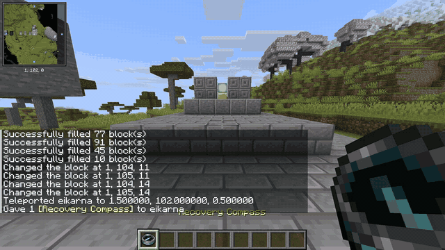
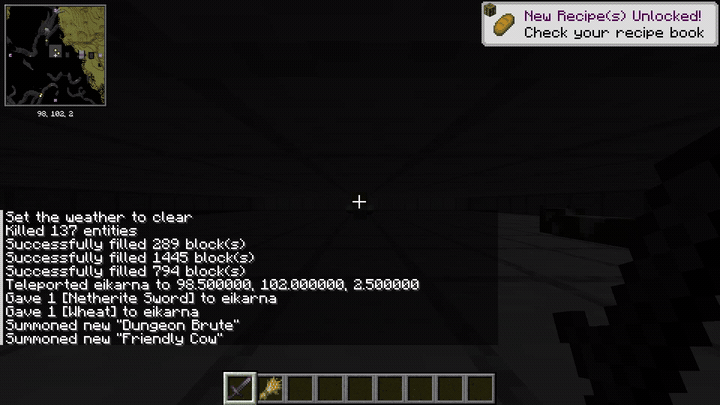
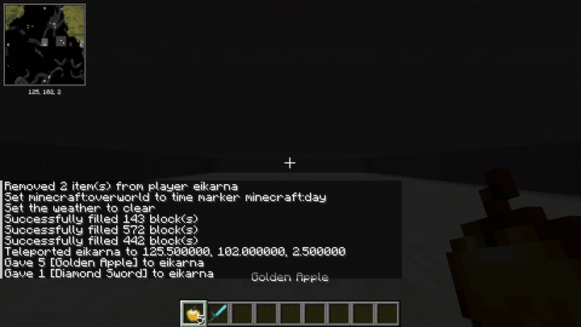

# Visual Showcase & Demos

Watch Effector MCP execute complex, multi-modal tasks inside Minecraft 26.2. All demonstrations were recorded directly from the live game client at 18-20 FPS.

---

## 1. 🧭 Native 3D Voxel Pathfinding
Zero-dependency 3D A-Star navigation computing walkable routes across multi-tier elevation, climbing staircases, navigating around obstacles, and reaching target coordinates:

* **Tool used**: `navigate_to`
* **Highlights**: Autonomous jump elevation, step climbing, gap negotiation, and goal inspection.

---

## 2. ⚔️ Perception Radar & Combat Actuator
360-degree entity radar scanning surrounding mobs, dynamically tracking hostile targets, sprinting to engage in melee combat, and interacting with passive wildlife:

* **Tools used**: `scan_entities`, `look_at`, `navigate_to`, `attack_entity`, `interact_entity`
* **Highlights**: Target acquisition by name, melee sword strike combo, loot pickup, and wheat feeding.

---

## 3. ⚡ Real-Time Zero-Polling SSE Event Streaming
Subscribing to game-tick event streams (`/events`) capturing player messages, action queue states, and physical completions with zero polling overhead:

* **Endpoint**: `http://127.0.0.1:8080/events`
* **Highlights**: Real-time event notifications delivered the exact millisecond actions occur.

---

## 4. 🍎 Procedural 3x3 Crafting Grid Assembly
The agent holds raw materials, procedurally distributes them across the 3x3 crafting matrix using simulated native right-clicks, places the core ingredient, and withdraws the crafted output:

* **Tools used**: `interact_block`, `click_container_slot`, `close_container`
* **Highlights**: Crafting a Golden Apple by distributing 8 gold ingots around an apple.

---

## 5. 🌉 Autonomous Backward Sneak-Bridging
Executing complex macro movement: locking pitch to block edges, engaging sneak mode, moving backward across thin air, and consecutive block placement without falling off:

* **Tools used**: `execute_actions`
* **Highlights**: Timed sneak-movement macro placing blocks beneath the character backward.

---

## 6. 🔮 Enchanting Table Automation
Inspecting the 3 available enchantment options, reading exact XP costs, clicking the chosen tier button via `click_container_button`, and verifying the enchanted item:

* **Tools used**: `get_open_container`, `click_container_button`, `click_container_slot`
* **Highlights**: Automated enchanting with slot verification.

---

## 7. 🧪 Real-Time Brewing Stand (Alchemy)
Loading Blaze Powder fuel, inserting potion water bottles, dropping Nether Wart, and tracking real-time bubbling tick decay:

* **Tools used**: `get_open_container`, `click_container_slot`
* **Highlights**: Reading brewing progress and automated ingredient insertion.

---

## 8. 🥩 Smoker & Furnace Thermal Processing
Feeding coal into fuel slots and raw meats into ingredient slots, detecting active combustion states, and collecting output cooked foods:

* **Tools used**: `get_open_container`, `click_container_slot`
* **Highlights**: Thermal state detection and automated fuel feeding.

---

## 9. 🔨 Anvil Repair & Combination
Restoring damaged tools using raw ingots or diamonds, computing exact XP repair costs, and retrieving restored mint-condition items:

* **Tools used**: `get_open_container`, `click_container_slot`
* **Highlights**: Tool repair cost inspection and output retrieval.

---

## 10. 🎯 Smooth 20 TPS Camera & Physics Macros
Executing camera sweeps and multi-axis rotations synchronized to engine ticks:

* **Tools used**: `execute_actions`
* **Highlights**: Smooth multi-axis yaw and pitch sweeps synchronized to game ticks.
